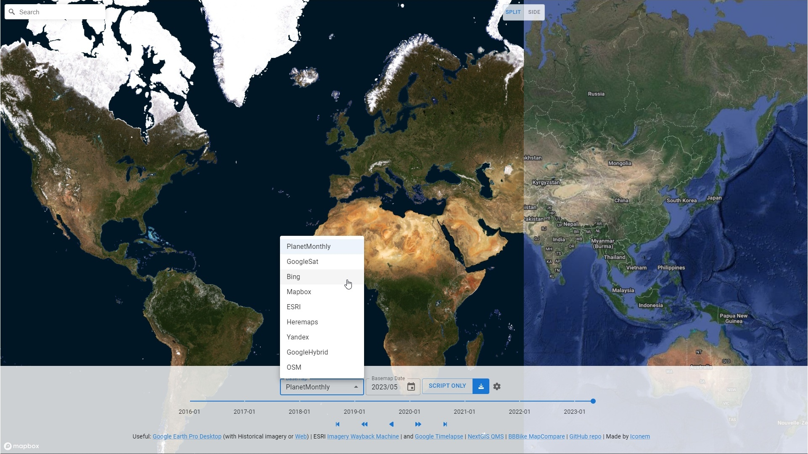

# historical-satellite

- [historical-satellite.iconem.com](https://historical-satellite.iconem.com/)
- [Github Repo](https://github.com/Iconem/historical-satellite)

## Intro

Simple app made to select through Planet Historical Monthly Basemaps and compare it against other TMS basemaps (like Google, Bing, Here, ESRI, Mapbox, Yandex, Apple). Useful for analyses like [Dilbarjin | LeMonde](https://www.lemonde.fr/international/article/2023/04/07/en-afghanistan-le-pillage-massif-d-un-site-archeologique-attribue-a-l-ei_6168703_3210.html) outside Qgis, directly within a web browser (inside or outside of Iconem).

Rough initial version, with:

- Downloads all planet-basemaps-monthly from 2016-01 to present with the map viewport as extent
- Side-by-side comparison of imagery datasets (Planet monthly at 2 different timestamps, or satellite imagery sources from planet/google/bing/here/esri/mapbox/yandex/apple)
- Downloaded images are geotiffs, so can be drag-and-dropped to qgis to get their location

## Features:

- 2 Maps in a Split view (split-screen or side-by-side)
- Settings component to select planet basemap timestamp
- Slider with play capabilities (forward/backward, play/pause or step-by-step and FPS control)
- Selector to choose raster source TMS url (via a TMS URL, or a planet monthly basemap)
- downloads planet monthly basemaps frames from 2016-01 to present via TiTiler (merge/crop tiles automagically and export to geotiff)
- Generate gdal_translate batch script to switches the burden from the browser (as well as remove the burden on Titiler middleware) to the user desktop client (prevents missing frames, allow larger resolution downloads, batches etc)



## TODO

- mapbox-gl-js [feature request](https://github.com/mapbox/mapbox-gl-js/issues/12707) to `Avoid tile popping/flicker on RasterTileSource setTiles` and associated [react-map-gl issue](https://github.com/visgl/react-map-gl/issues/1876)

# Similar work

## Other Periodic whole-world mosaics

Cross-posting a [twitter thread](https://twitter.com/jo_chemla/status/1656686529245224961) also on the [cloud-native-geospatial](https://matrix.to/#/!XLiaSxMFAxLGczqmlz:gitter.im/$d9-iUv9lizz1aoIjnlTKtq1w1-NAmY7CqBAiahOu6yM?via=gitter.im&via=matrix.org&via=chard.com) gitter community

Looking for cloud-free, worldwide, periodic (yearly/monthly) mosaics like

- [Google Earth Web](https://earth.google.com/web/@53.15559085,-1.0098299,428.20825693a,5430806.16808712d,35y,0h,0t,0r/data=CgwqBggBEgAYAUICCAFKDQj___________8BEAA) now supports both high-res historical imagery as well as [Google Earth Timelapse](https://earthengine.google.com/timelapse/) (yearly 1984-2020) from Landsat/Sentinel data, mp4 tiles
- [Planet monthly basemaps](https://www.planet.com/products/basemap/) for 2016-01 - present
- [ESA WorldCover](https://esa-worldcover.org/en) 2020-2021 from Sentinel with large time coverage

Wondering if one of the following orgs have such a dataset from:

- institutions like ESA, NASA
- consortiums like OGC, pangeo_data
- or large scale EO programs from Earth on AWS, Microsoft Planetary Computer, Google Earth Engine

This kind of mosaic/TMS would alleviate the need to tile on the fly via the geemap libraries. More responsive for change analysis anywhere on earth. Probably might be helpful to get insights from folks at

References:

- Vincent Sarago [Cog talk](https://medium.com/devseed/cog-talk-4ter-distributed-processes-8ee280f71080)
- Qiusheng Wu [Geemap Timelapse](https://giswqs.medium.com/a-streamlit-app-for-creating-timelapse-of-annual-landsat-imagery-1984-2021-3db407a8ac32=)
- Kyle Barron [cog-mosaic post](https://kylebarron.dev/blog/cog-mosaic/overview)
- SentinelHub `How to Make the Perfect Time-Lapse of the Earth` [great post](https://medium.com/sentinel-hub/how-to-make-the-perfect-time-lapse-of-the-earth-351f214527f6) shared by Andras Zlinszky
- [Azavea 2020 blog](https://www.azavea.com/blog/2020/01/02/how-to-find-the-most-recent-satellite-imagery/) distinguishing between Free vs Paid Browsable vs Downloadable data

Also useful; EsriWayback integrated within [iD OSM Editor](https://github.com/OpenHistoricalMap/iD/pull/181) from OpenHistoricalMap as well as within [facebook/Rapid](https://github.com/facebook/Rapid/issues/1209) and [here](https://github.com/facebook/Rapid/pull/1351), both of which are tools really worth digging into


## Consume temporal TMS in QGIS

[QGis feature request](https://github.com/qgis/QGIS/issues/51939)
A successfully implemented workaround is to create a macro which, at project opening, would get the xyz tile layer, as well as the temporal controller, and update the tile source on the temporal controller update by connecting the update to the

```py
def update_query_layer():
        tct = tc.dateTimeRangeForFrameNumber(tc.currentFrameNumber()).begin().toPyDateTime()
        newSource = f'type=xyz&url=https://server.com/{tct.year}_{tct.month:02d}' + '/{z}/{x}/{y}.png'
        layer.setDataSource(newSource, f'{tct.year}_{tct.month:02d}', layer.dataProvider().name())

tc = iface.mapCanvas().temporalController()
tc.updateTemporalRange.connect(update_query_layer)
```
