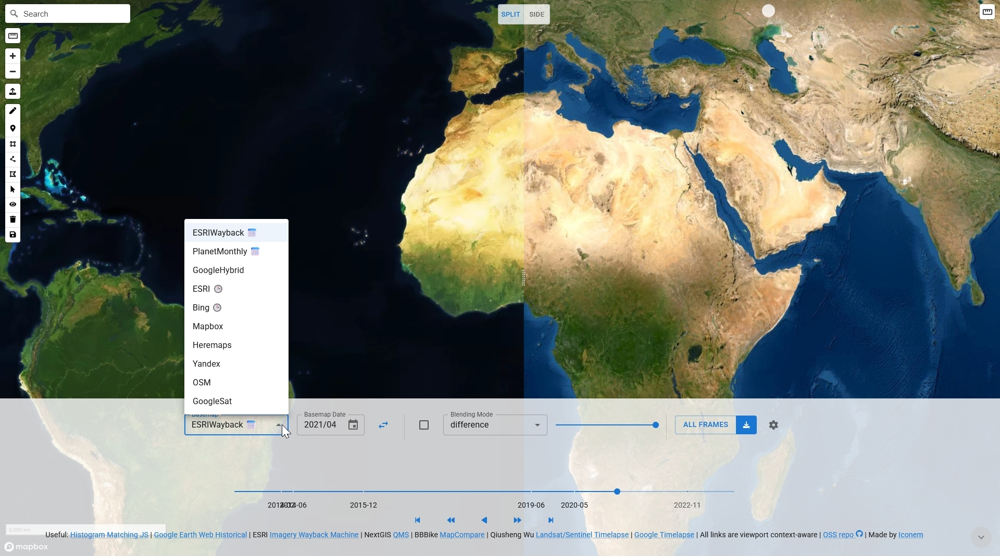

# historical-satellite

Simple map UX to select through Planet Historical Monthly Basemaps and compare it against other TMS basemaps (like Google, Bing, Here, ESRI, Mapbox, Yandex)

https://historical-satellite.iconem.com/

Rough initial commit, with:

- App made mostly to compare existing satellite imagery sources + to Download planet-basemaps-monthly
- Side-by-Side Comparison between 2 datasets (2 planet at 2 timestamps, or google/bing etc)
- By default, downloads all monthly maps from 2016-01 to present with the map viewport as extent

Features:

- 2 Maps in a Split view (split-screen or side-by-side)
- Settings component to select basemap timestamp
- Slider with play capabilities (forward/backward, auto or step-by-step and FPS)
- Selector to choose raster source TMS url (via a TMS URL, or a planet monthly basemap)
- downloads planet monthly basemaps frames from 2016-01 to present via TiTiler (merge/crop tiles automagically and export to geotiff)
- Generate gdal_translate batch script to remove the burden from the browser (and Titiler middleware) to the user desktop client (prevents missing frames, allow larger downloads etc)

